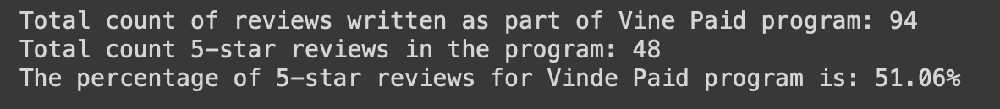
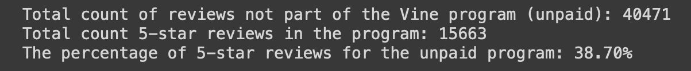

# Amazon_Vine_Analysis

## Overview
This repo performs data-analytics / (ETL Process) to extract a dataset from S3, transform the data, connect to an AWS RDS instance, and load the transformed data into pgAdmin. Next, with PySpark analysis is done to determine if there is any bias toward favorable reviews from (Paid) Vine members in the dataset.

## Results:
This ETL/Analysis was performed on a Video Game Review dataset from Amazon S3. After extracting the data from S3 and filtering the appropriate columns with desired values the Vine Review Analysis was done.

### Paid 

- As seen in the image above there are 94 paid Vine reviews and 48 of the reviews were 5 Stars. Resulting in 51.06 % of the total reviews being perfect 5 Stars.

### Unpaid

- As seen in the image above there are 40,471 non-Vine reviews and 15,663 of the reviews were 5 Stars. Resulting in around 39% of the total reviews being perfect 5 Stars. 

## Summary
In conclusion, the analysis shows that the probability of positivity bias for reviews in the Vine program is very likely to be true. As the 5 Star review perentage of the paid Vine reviews are significantly higher than the non-Vine reviews. We can also conclude that the pay is definetly a factor that influences how the users review the game as supported by the results. One additional analysis that could support the statement would be to peform this analysis on more than one review samples realated to Vine paid vs non-paid datasets. 
